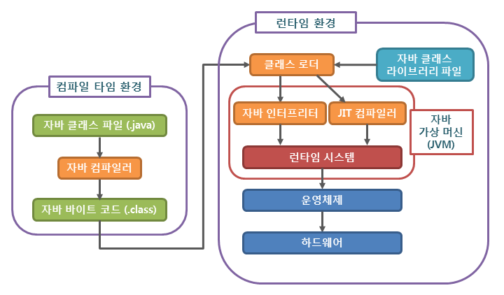

1. 자바 소스코드 (.java) 작성
2. 자바 컴파일러가 소스파일을 컴파일하여 JVM이 이해할 수 있는 자바 바이트 코드(.class)파일을 생성
3. 컴파일된 바이트 코드를 JVM의 클래스 로더(Class Loader)에게 전달
4. 클래스 로더는 동적로딩(Dynamic Loading)을 통해 필요한 클래스들을 로딩 및 링크하여 런타임 데이터 영역 (JVM의 메모리)에 올림

   클래스 로더 세부 동작: 
   4-1. 로드: 클래스 파일을 가져와서 JVM의 메모리에 로드 
   4-2. 검증: 자바 언어 명세(Java Language Specification) 및 JVM 명세에 명시된 대로 구성되어 있는지 검사 
   4-3. 준비 : 클래스가 필요로 하는 메모리를 할당 (필드, 메서드, 인터페이스 등등) 
   4-4. 분석 : 클래스의 상수 풀 내 모든 심볼릭 레퍼런스를 다이렉트 레퍼런스로 변경 
   4-5. 초기화 : 클래스 변수들을 적절한 값으로 초기화 (static 필드)

5. 실행엔진(Execution Engine)은 JVM 메모리에 올라온 바이트 코드들을 명령어 단위로 하나씩 가져와서 실행

   5-1. Interpreter: 바이트 코드 명령어를 하나씩 읽어서 해석하고 실행 (하나하나의 실행은 빠르나, 전체적인 실행 속도가 느리다.)  
   5-2. JIT(Just-In-Time-Compiler): Interpreter의 단점을 보완하기 위해 도입된 방식으로 코드 전체를 컴파일하여 바이너리 코드로 변경하고, 바이너리 코드로 직접 실행하는 방식 (전체적인 실행속도는 Interpreter보다 빠르다.)

 

