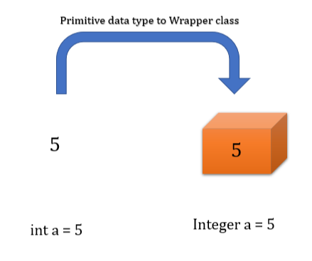
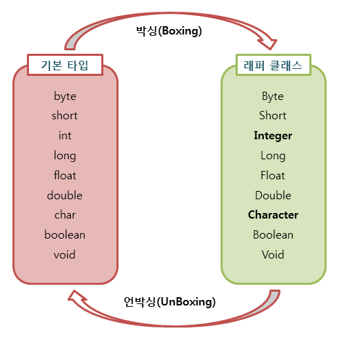

# Wrapper class

자바의 Wrapper class는 primitive type을 객체로 감싸주는 역할을 한다.
이러한 클래스를 객체로 만들거나 내부 값을 연산해야 하는 경우 Boxing, UnBoxing이 사용된다.



<br/>

# Boxing

primitive type의 데이터 -> wrapper class의 인스턴스로 변환

# UnBoxing

wrapper class의 인스턴스에 저장된 값 -> primitive type의 데이터로 변환



<br/>

# AutoBoxing & AutoUnBoxing

JDK 1.5부터는 Boxing과 UnBoxing이 필요한 상황에 컴파일러가 처리해주기 시작했다.

```java
// Boxing & UnBoxing
Integer num = new Integer(1);   // Boxing
int n = num.intValue();         // UnBoxing

// AutoBoxing & AutoUnBoxing
Integer num = 1;    // new Integer() 생략
int n = num;        // intValue() 생략
```

# Boxing & UnBoxing 성능

Boxing을 수행할 때마다 새로운 객체가 힙 메모리에 생성된다. 이에따라 가비지 컬렉션이 더 자주 발생하게 되어 성능에 부정적인 영향을 미칠 수 있다.
또한 UnBoxing 과정에서도 객체 참조를 따라 실제 primitive 값을 추출하는 비용이 발생한다.
따라서 성능 측면에서 봤을때 wrapper class가 반드시 필요한 상황이 아니라면 지양 하는 것이 좋겠다.

<br/>

### 참고

[Inpa Dev 👨‍💻:티스토리](https://inpa.tistory.com/entry/JAVA-☕-wrapper-class-Boxing-UnBoxing#박싱boxing__언박싱unboxing)
