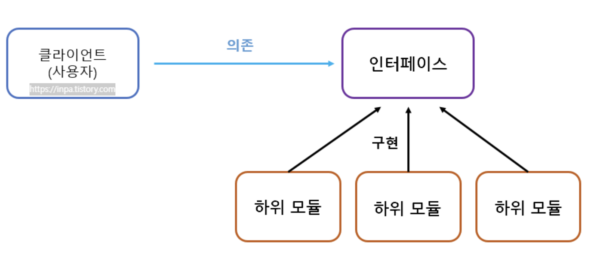

# 1. SRP 단일 책임원칙

하나의 메소드(객체)는 하나의 책임만을 갖는다

# 2. OCP 개방 폐쇄 원칙

클래스는 확장에 대해서는 개방하고 수정에 대해서는 폐쇄적으로 설계한다 (추상화 사용을 통한 확장성 구축)

# 3. LSP 리스코프 치환 원칙

자식 객체는 모두 부모 객체로 치환될 수 있어야 한다

```java

public void myData() {
    Collection linkedList = new LinkedList();
    Collection hashSet = new HashSet();
    run(linkedList);
    run(hashSet)
}

public void run(Collection data){
    list.add(1);
}

```

# 4. ISP 인터페이스 분리 원칙

인터페이스를 사용목적네 맞게끔 정확히 분리한다

# 5. DIP 역전 주입 원칙

마찬가지로 객체를 주입하는 대신 추상화 클래스나 인터페이스를 주입받는다


<br/>
참고자료:

[객체 지향 설계의 5가지 원칙 - S.O.L.I.D](https://inpa.tistory.com/entry/OOP-%F0%9F%92%A0-%EA%B0%9D%EC%B2%B4-%EC%A7%80%ED%96%A5-%EC%84%A4%EA%B3%84%EC%9D%98-5%EA%B0%80%EC%A7%80-%EC%9B%90%EC%B9%99-SOLID)
