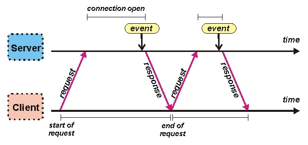

# Polling

- 일정 주기로 API로 스테이터스 체크
- 구현 쉬움
- HTTP오버헤드 발생
- 실시간성 떨어짐
- 일정하게 갱신되는 서버 데이터의 경우 유리
- 다른 방식에 비해 네트워크 오류 등에 유리 그냥 재시도 하면됨
- 결제 대기에 사용

# Long Polling

- 클라이언트에서 요청을 보내면 서버는 특정 이벤트 변경 혹은 타임아웃이 될때까지 대기하였다 이벤트 발생시 응답을 주는 방식
- HTTP응답을 유지한 채로 대기
- 응답이 오면 클라이언트는 바로 다시 재요청
- 다수의 클라이언트에게 동시에 이벤트가 발생하면 서버 리소스 관리가 힘들다 (스레드/커넥션 풀 관리)
- WS/SSE 사용이 어려운 환견 혹은 연결 수가 매우 제한적인 경우에 주로 사용

# Websocket

- 양방향 통신
- 웹소켓 포트에 접속한 모든 클라이언트에게 이벤트 방식으로 응답 (구독 형태)
- 최초 잡석은 HTTP요청이기 때문에 추가적인 방화벽 처리 같은 것이 불필요하다.
- 하지만 websocket 통신용 전이중 통신괴 새로운 서버가 필요하다.

# SSE

- HTML5 부터 등장 어느정도의 WS 역할을 하면서 다 가볍다
- server → client 단방향 push
- ajax로 쉽게 이용
