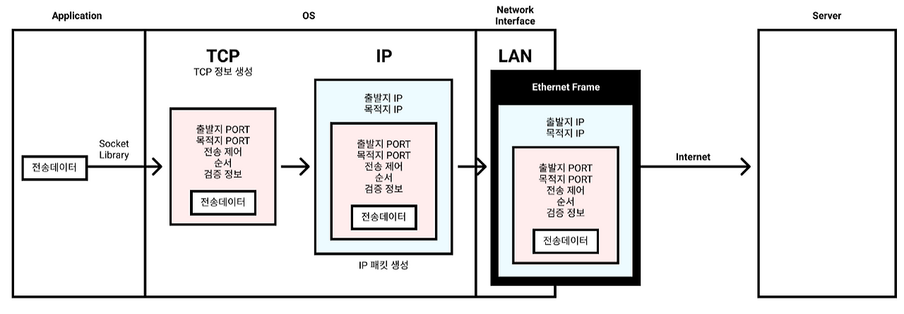
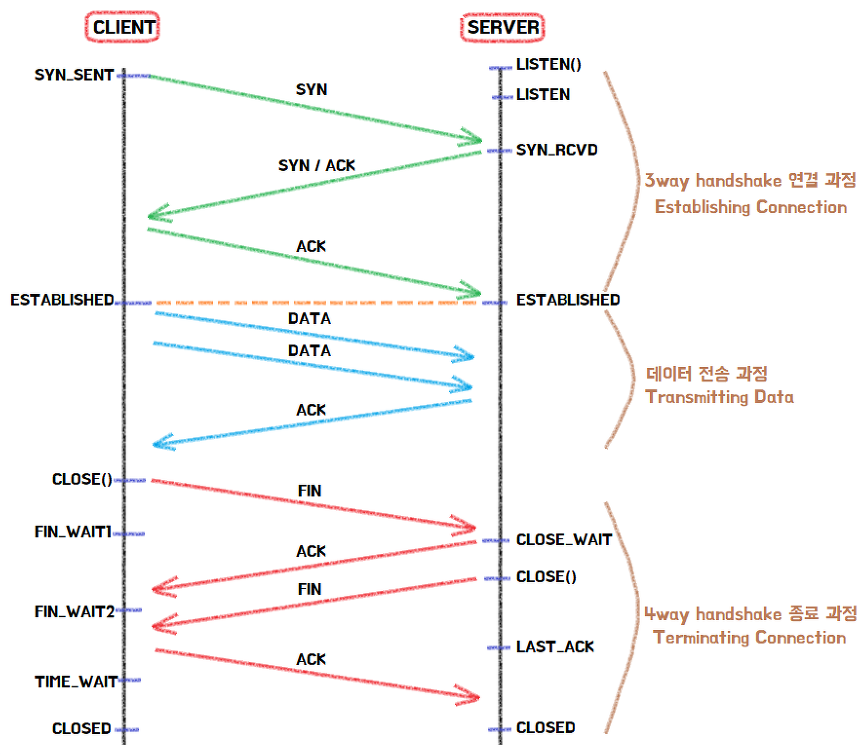
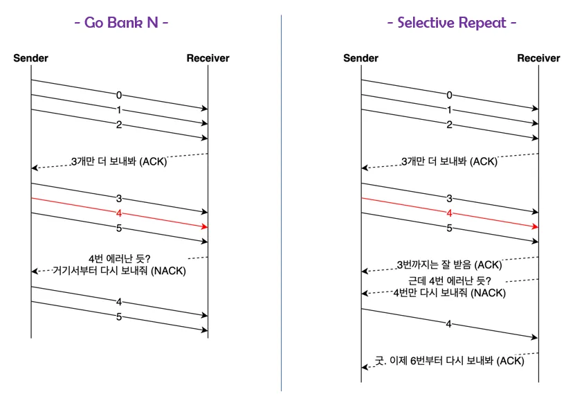

# TCP (Transmission Control Protocol)

- TCP는 IP 규칙으로만 통신할 때 패킷 순서가 변경되거나 패킷이 유실되는 불안정한 점들을 보완해, 패킷 전송을 제어하여 신뢰성을 보장하는 프로토콜이다.

## TCP 통신 과정

1. 전송 데이터를 TCP 포장한다.
2. 포장한 전송데이터를 IP 포장한다.
3. 포장한 전송데이터를 이더넷 포장한다.
4. 인터넷을 통해 상대 컴퓨터 서버에 도달하여 포장된걸 하나씩 풀며 전송데이터를 받게 된다.

## TCP Handshake

TCP는 데이터를 전달하기 전과 전달한 후에 목적지 상태를 확인하다.
이러한 과정이 3-way handshke와 4-way handshake 과정이다.

- SYN: 접속요청을 할 때 보내는 플래그 (패킷)
- ACK: 상대방으로부터 패킷을 받은 뒤에, 잘 받았는지 알려주는 플래그 (패킷)
- FIN: 접속 종료를 위한 플래그 (패킷)

- 3-way handshake 과정을 통해 양방향 접속 상태를 만든다.
- 데이터 전송 과정에서 클라이언트가 서버로부터 ACK를 못 받았으면 데이터를 재전송한다.
- 4-way handshake 과정에서 ACK 플래그를 전송할 때 만일 서버에서 클라이언트로 보낼 남은 데이터가 있을 경우 나머지를 모두 전송 시킨다.

## TCP의 전송 제어 기법

1. 흐름 제어 (Flow Control)
   - 송신자가 수신자의 데이터 처리 속도를 고려해 데이터 전송 속도 조절
   - 슬라이딩 윈도우 기법 사용
2. 오류 제어 (Error Control)
   - 통신 중 장애가 발생했을때 데응
   - Go Bank N 기법
     - 어느 데이터로부터 오류가 발생했는지 파악해서 그 부분만 다시 전송
   - Selective Repeat 기법
     - 에러난 데이터만 재전송하고 순서가 잘못된 버퍼 재정렬

   

3. 혼잡 제어 (Congestion Control)
   - 네트워크의 혼잡상태가 간지되면 송신측의 전송 데이터를 조절한다.
   - TCP에는 Tahoe, Reno, New Reno, Cubic, Elastic-TCP ..등 다양한 혼잡 제어 기법이 존재한다.

# TCP 특징

- 높은 신뢰성 보장
- UDP보다 속도가 느림
- 전이중(Full-Duplex), 점대점(Point to Point) 방식
  - 전이중: 통신이 양방향으로 동시에 일어날 수 있다.
  - 점대점: 각 연결이 정확히 2개의 엔드포인트를 갖는다.

# UDP (User Datagram Protocol)

- 목적지만 분명한 전송할 수 있다
- 신뢰성을 보장하지 않는다
- TCP의 신뢰성 보장을 위한 프로세스들이 빠지기 때문에 속도가 올라간다
- UDP는 커스텀을 통해 신뢰성을 보장할 수 있고 설계에 따라 신뢰성과 빠른 속도를 만들어낼 수 있다. (QUIC 프로토콜)

# HTTP/3는 UDP 선택

- 데이터양이 많아짐에 따라 TCP의 한계는 명확해졌기 때문에 UDP를 선택한 것으로 보인다

### 참고

[inpa.tistory.com](https://inpa.tistory.com/entry/NW-%F0%9F%8C%90-%EC%95%84%EC%A7%81%EB%8F%84-%EB%AA%A8%ED%98%B8%ED%95%9C-TCP-UDP-%EA%B0%9C%EB%85%90-%E2%9D%93-%EC%89%BD%EA%B2%8C-%EC%9D%B4%ED%95%B4%ED%95%98%EC%9E%90#http_/_ip_/_tcp_/_udp_%EB%8A%94_%EB%AA%A8%EB%91%90_%ED%94%84%EB%A1%9C%ED%86%A0%EC%BD%9C)
